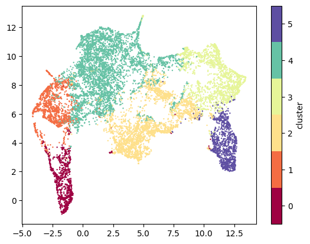
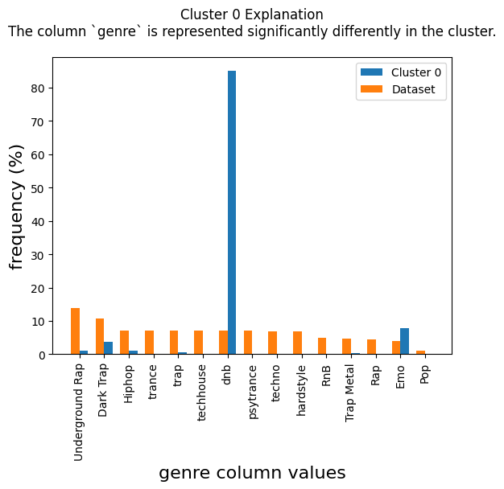
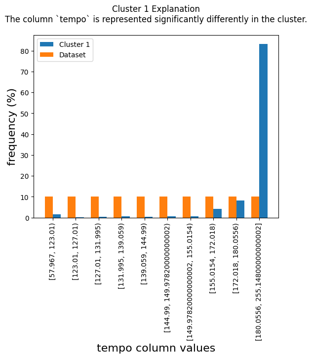

# TabEE - Tabular Embeddings Explanations
The paper was published in SIGMOD24' and available <a href="[https://dl.acm.org/doi/abs/10.1145/3639329]">here</a>.

### Introduction

Tabular embedding methods have become increasingly popular due
to their effectiveness in improving the results of various tasks, including
classic databases tasks and machine learning predictions.
However, most current methods treat these embedding models as
"black boxes" making it difficult to understand the insights captured
by the models. **TabEE** proposes a novel approach to interpret
these models, aiming to provide local and global explanations for
the original data and detect potential flaws in the examined embedded
models. The proposed solution is appropriate for every tabular
embedding algorithm, as it fits the black box view of the embedding
model. By treating
these models as more transparent, we believe our research will contribute
to the development of more effective and reliable embedding
methods for a wide range of applications.

### Requirements
The requirements for running the package:
```
scipy==1.10.1
numpy==1.23.5
pandas==2.0.1
tqdm==4.65.0
matplotlib==3.7.1
scikit-learn==1.2.2
umap-learn==0.5.3
```
They can be installed using the command
```python
pip install -r requirements.txt
```
### Example
To create and output a full explanation of the embedding:
```python
from TabEE import EmbeddingExplainer
explainer = EmbeddingExplainer(dataset, embedding, range(2, 8, 1))
explainer.generate_and_plot_explanation()
```





